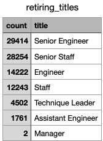
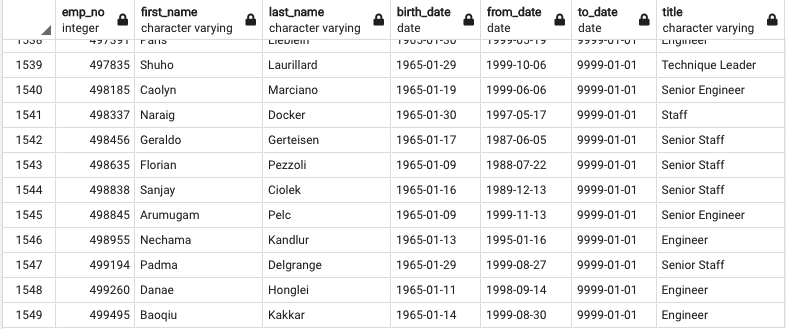
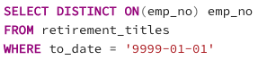
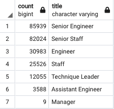

# Pewlett Hackard Analysis

## Overview of the Analysis

The purpose of this analysis is to determine the number of retiring employees per title, and identify employees who are eligible to participate in a mentorship program. We are doing this in preparation for the "silver tsunami" or the mass exodus of elderly employees retiring. We will be using SQL queries in Postgres to extract the neccesary tables we need and export them as csvs.

## Results

The above screenshot shows how many employees are retiring by title.

- The first observation we can make from the data we collected is the disproportionate amount of employees who are senior engineers or staff who are retiring. This makes sense, as tenured employees have a higher likelihood of being promoted to the senior level. As this large number of senior employees retires, the void must be filled with either internal promotions or external hiring.

- We can also see that there is a much lower number of technique leaders and assistant engineers who are retiring. We can use this to our advantage and focus on external hires to fill these base level positions, while promoting current staff, engineers, assistant engineers, and technique leaders.

The above screenshot shows how many employees are eligible for the mentorship program.

- When analyzing the employees who are eligible for the mentorship program, we can see that there are very few eligibile in relation to the vast number of employees retiring. There are roughly 72,458 employees retiring and only 1,549 who are eligible for the mentorship program. This will make the tranition of filling the retired employees much more difficult and may make external hiring a larger requirement.

- Finally, we can look at the number of employees retiring in relation to the total number of employees at the company. There are roughly 240,000 total current employees, and roughly 72,458 retiring. With nearly a third of the company leaving, there must be major accomidations made to have a smooth transition.

## Summary

### How many roles will need to be filled as the "silver tsunami" begins to make an impact?

Using the above query, we were able to calculate that there are currently 72,458 employees that will be retiring in the "silver tsunami". In the above screenshot, you can see the total current number of employees by title. If we break it down by position, 29,414 Senior Engineers are retiring out of the 85,939 current employees, 28,254 Senior Staff are retiring out of 82,024, 14,222 Engineers are retiring out of 30,983, 12,243 Staff are retiring out of 25,526, 4,502 Technique Leaders are retiring out of 12,055, 1,761 Assistant Engineers are retiring out of 3,588, and finally 2 Managers are retiring out of 9. Proportionately, the positions hit the hardest are Engineers, Staff, and Assistant Engineers with roughly half of the employees retiring. The rest of the titles have roughly 1/3 leaving. Based on this information, there are enough people to be internally promoted to fill the void left by the retirees. But external hiring would have to take place to fill the positions of the promotees. As discussed above, most of these roles are senior engineers and staff. It is unknown when exactly each employee will retire, or the rate that they will be retiring, but preparations must be made to promote in houe employees as well as hire externally.

### Are there enough qualified, retirement-ready employees in the departments to mentor the next generation of Pewlett Hackard employees?

With only 1,549 employees eligible for the mentorship program and 72,458 employees retiring whose positions need to be filled, it will be highly unlikely that there will be enough mentors to go around. It would be advisable to hire outside help to assist in the mentorship as well as having a single mentor for numerous employees.